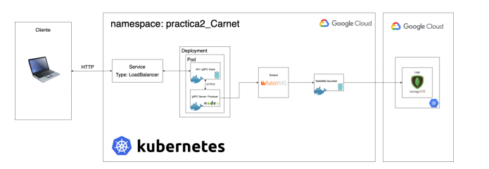
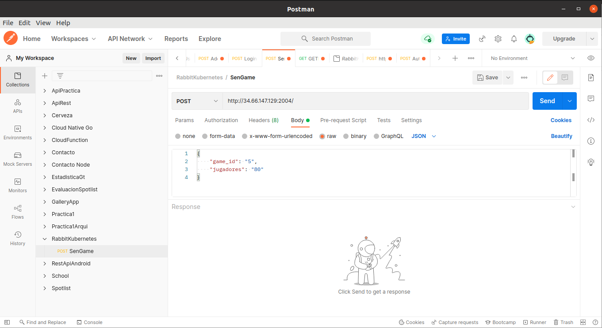
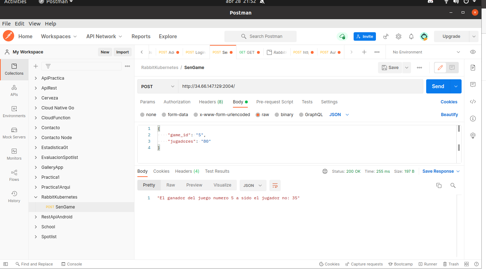
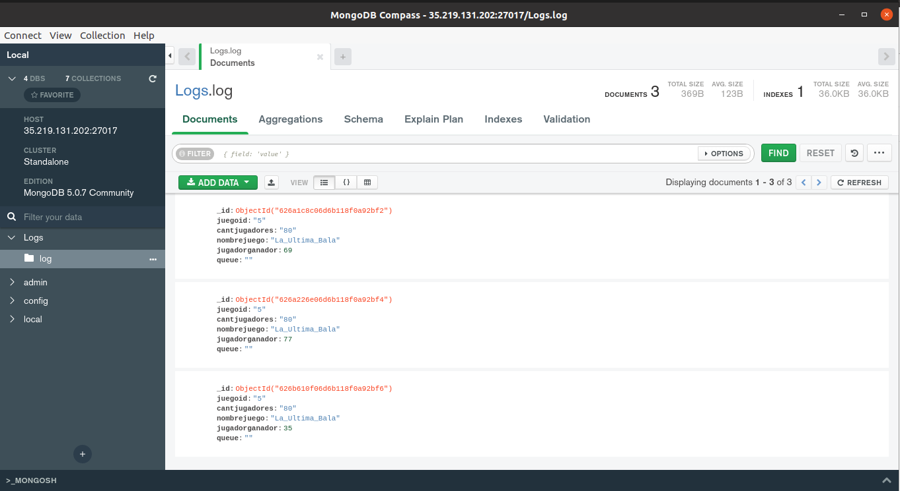

# Manual de Usuario

# Arquitectura
A continuacion podra observar la arquitectura armada con el codigo fuente del repositorio
es importante mencionar que posteriormente se realizara una breve explicacion de las tecnologias
utilizadas.

# Requerimientos
- Un cliente HTTP que nos da la posibilidad de enviar Peticiones

# Modalidad de Uso
Realizaremos la presentacion del uso de la arquitectura, mediante la utilizacion de postman
sin embargo queda a discrecion del lector el cliente a utilizar ya que lo unico que se pretende
realmente es explicar el procedimiento.

## Primer paso de envio de peticion
En la siguiente imagen podra observar que necesita definir lo siguiente:

- Direccion y puerto : http://34.66.147.129:2004/
- Especificar el tipo de Peticion POST

Si desea poder ir al enlace podra observar, un mensaje de que se encuentra en la api del cliente

## Definir el objeto JSON
En la imagen podra observa la estructura que necesita enviar al cliente para poder hacer
uso de la misma

## Enviar peticion
Al enviar la peticion debera recibir un mensaje de los resultados del juego que genero 
y al observar la arquitectura podra darse cuenta del proceso que llevo

## Almacenamiento en la Base de datos
A continuacion se podra mostrar algunos logs generados y que se han guardado en la base de datos.

